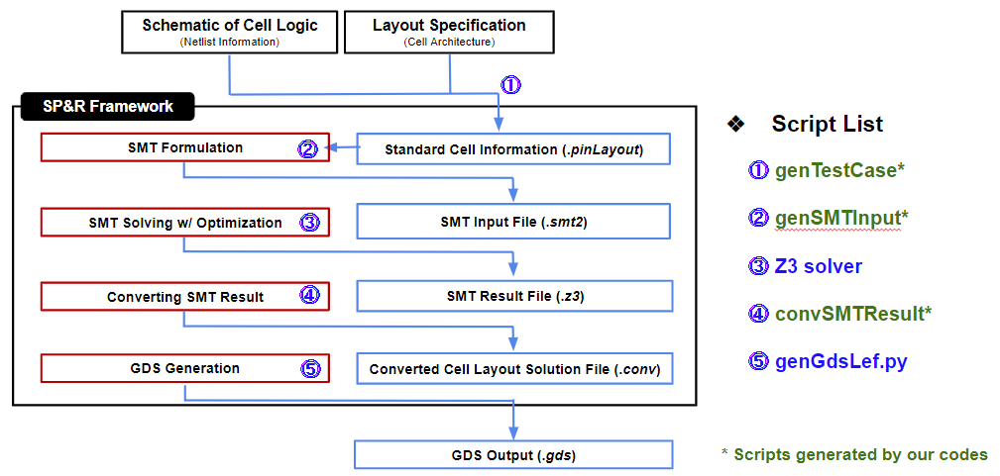

# SMT based Standard Cell Layout Generator
This GitHub repo provides the C++ version SMT based standard cell layout generator.

The layout generation flow is shown in the below flow chart.

|  |
|:--:|


# User Notes (for Installation)
- For dependency to **fmt**. Follow the installation guide here: [fmt](https://fmt.dev/latest/usage.html#building-the-library).
- For dependency to **jsoncpp**. Follow the installation guide here: [jsoncpp](https://github.com/nlohmann/json#integration).
- For dependency to **boost_regex**. Follow the installation guide here: [boost_regex](https://www.boost.org/doc/libs/1_79_0/libs/regex/doc/html/boost_regex/install.html).

# Run Guide
- Generate program files (Compile C++ codes)
```bash
# Compile genTestCase
make genTestCase

# Compile genSMTInput
make genSMTInput

# Compile convSMTResult
make convSMTResult

# Compile all three
make all
```
- Run program files
```base
# Run genTestCase
./genTestCase {netlist_file} {size_offset} {fin_mode}
  - ex. ./genTestCase ./netlists/PROBE_3F.cdl 13 3
  - The cell list must be defined in the 'genTestCase.cpp' before compiling.
  
# Run genSMTInput
./genSMTInput {pinLayout_file} {json_file}
  - ex. ./genSMTInput ./pinLayouts_3F_5T/AND2_X1.pinLayout ./config/config_3F_5T_EL.json
  
# Run convSMTResult
./convSMTResult {Z3_file} {cell_name} {output_directory} {pinLayout_directory}
  - ex. ./convSMTResult ./Z3/XOR2_X1_3F_5T_ET_MPO2.z3 XOR2_X1 ./solutionSMT ./pinLayouts_3F_5T
```

# Past & Related Repository
- **FinFET Based**
  - SMT-based-STDCELL-Layout-Generator \[[Link](https://github.com/ckchengucsd/SMT-based-STDCELL-Layout-Generator)\]
  - SMT-based-STDCELL-Layout-Generator-for-PROBE2.0 \[[Link](https://github.com/ckchengucsd/SMT-based-STDCELL-Layout-Generator-for-PROBE2.0)\]
- **VFET Based**
  - SMT-based-STDCELL-Layout-Generator-for-VFET
 \[[Link](https://github.com/ckchengucsd/SMT-based-STDCELL-Layout-Generator-for-VFET)\]
- **CFET Based**
  - SMT-based-STDCELL-Layout-Generator-for-CFET (Pending Open Source) \[[Link](https://github.com/Dinple/SMT-based-STDCELL-Layout-Generator-for-CFET)\]
- **PROBE3.0**
  - Design-Technology pathfinding framework incorporating the SMT based cell layout generator \[[Link](https://github.com/ABKGroup/PROBE3.0)\]

# Knowledge Reference
- Park, Dong Won Dissertation: [Logical Reasoning Techniques for Physical Layout in Deep Nanometer Technologies](https://escholarship.org/content/qt9mv5653s/qt9mv5653s.pdf)
- Ho, Chia-Tung Dissertation: [Novel Computer Aided Design (CAD) Methodology for Emerging Technologies to Fight the
Stagnation of Moore¡¯s Law](https://escholarship.org/content/qt2ts172zd/qt2ts172zd.pdf)
- D. Park, I. Kang, Y. Kim, S. Gao, B. Lin, and C.K. Cheng, "ROAD: Routability Analysis and Diagnosis Framework Based on SAT Techniques," ACM/IEEE Int. Symp. on Physical Design, pp. 65-72, 2019. \[[Paper](https://dl.acm.org/doi/pdf/10.1145/3299902.3309752)\] \[[Slides](https://cseweb.ucsd.edu//~kuan/talk/placeroute18/routability.pdf)\]
- D. Park, D. Lee, I. Kang, S. Gao, B. Lin, C.K. Cheng, "SP&R: Simultaneous Placement and Routing Framework for Standard Cell Synthesis in Sub-7nm," IEEE Asia and South Pacific Design Automation, pp. 345-350, 2020. \[[Paper](https://ieeexplore.ieee.org/stamp/stamp.jsp?tp=&arnumber=9045729)\] \[[Slides](https://www.aspdac.com/aspdac2020/archive/pdf/5C-3.pdf)\]
- C.K. Cheng, C. Ho, D. Lee, and D. Park, "A Routability-Driven Complimentary-FET (CFET) Standard Cell Synthesis Framework using SMT," ACM/IEEE Int. Conf. on Computer-Aided Design, pp. 1-8, 2020. \[[Paper](https://ieeexplore.ieee.org/stamp/stamp.jsp?tp=&arnumber=9256570)\]
- D. Lee, C.T. Ho, I. Kang, S. Gao, B. Lin, and C.K. Cheng, "Many-Tier Vertical Gate-All-Around Nanowire FET Standard Cell Synthesis for Advanced Technology Nodes," IEEE Journal of Exploratory Solid-State Computational Devices and Circuits, 2021, Open Access. \[[Paper](https://ieeexplore.ieee.org/stamp/stamp.jsp?tp=&arnumber=9454552)\]
- C.K. Cheng, C.T. Ho, D. Lee, and B. Lin, "Multi-row Complementary-FET (CFET) Standard Cell Synthesis Framework using Satisfiability Modulo Theories (SMT)," IEEE Journal of Exploratory Solid-State Computational Devices and Circuits, 2021, Open Access. \[[Paper](https://ieeexplore.ieee.org/stamp/stamp.jsp?tp=&arnumber=9390403)\]

